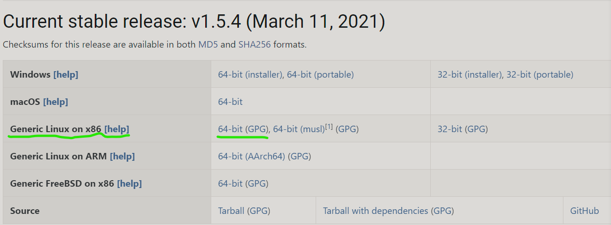
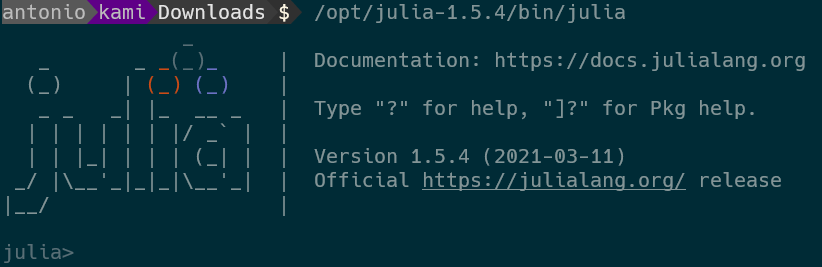
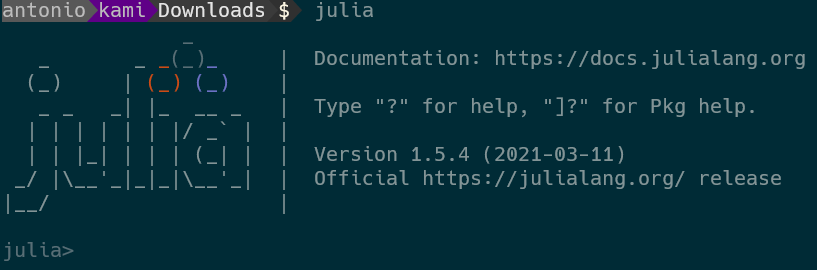

# Installing Julia on Linux

Some days ago I was reading a story on Hacker News related to Julia.  
One of the comments was about not knowing how to install Julia on Linux.

## These are the steps I take.


***1.  Navigate to the Julia download page.***

https://julialang.org/downloads/

***2. Choose your desired version LTS or Current stable release:***

Choose your platform (Linux 64)

    Generic Linux on x86, 64bit



***3.  Download Julia.***

Right-click on the chosen version and click on "Copy link address"

In the terminal type: ```wget -c``` and next to that paste the link address you copied.

The whole line should look as below.

`wget -c https://julialang-s3.julialang.org/bin/linux/aarch64/1.5/julia-1.5.4-linux-aarch64.tar.gz`

This will download Julia to the current directory.

***4.  Install Julia (Extract Julia)***

Run the following command, which will extract julia to the ```/opt``` directory.

`sudo tar xf julia-1.5.4-linux-x86_64.tar.gz -C /opt`
    
Julia is now installed, and to use it you type the following:

`/opt/julia-1.5.4/bin/julia`
    
The screen should display something similar to the image.



***5.  Create a symbolic link.***

Because we don't want to be typing the following command to run julia.  
`/opt/julia-1.5.4/bin/julia`

And we would rather just type ```julia```
        
we create a symbolic link.

`sudo ln -s /opt/julia-1.5.4/bin/julia /usr/local/bin/julia`

Test the symbolic link.

just type `julia`



If you see an image similar to the this one, the symbolic link is working.

## You now have Julia installed on Linux!
